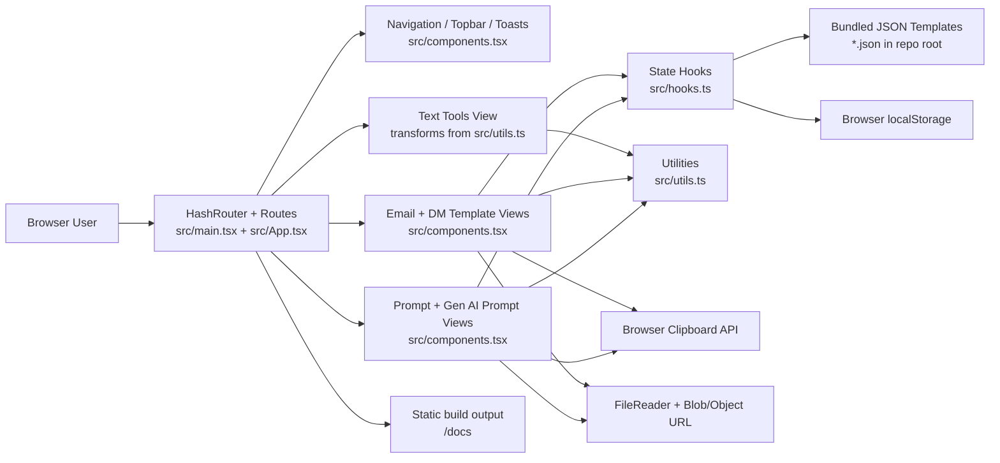

# Architecture

## High-Level System Overview

Text Studio is a client-side single-page application built with React, TypeScript, and Vite. The app runs entirely in the browser: `src/main.tsx` mounts the application inside a `HashRouter`, `src/App.tsx` selects one of five route-based workspaces, and the UI logic is implemented in reusable React components and hooks. There is no backend server, API layer, database, queue, Lambda, or other server-side runtime in this repository.

The application combines two browser-side data sources. Bundled JSON files such as [`email-templates.json`](/E:/Learnings/Projects/other-tools/email-templates.json) and [`prompt-templates.json`](/E:/Learnings/Projects/other-tools/prompt-templates.json) provide starter content at build time, while `localStorage` persists user changes at runtime through `useBasicTemplateManager` and `usePromptTemplateManager` in [`src/hooks.ts`](/E:/Learnings/Projects/other-tools/src/hooks.ts). Build output is emitted to [`docs/`](/E:/Learnings/Projects/other-tools/docs), which matches the GitHub Pages deployment shape configured in [`vite.config.ts`](/E:/Learnings/Projects/other-tools/vite.config.ts).

## Component Diagram

### Notes on Services and Storage

- Services: none found in the codebase
- Lambdas/functions: none found in the codebase
- Queues/async backplanes: none found in the codebase
- Persistent storage: browser `localStorage`
- Bundled seed data: root-level JSON files imported into `src/App.tsx`
- Deployment artifact: static files in `docs/`

## Data Flow

1. The browser loads the Vite-built static site from `docs/`; `src/main.tsx` mounts the React app inside `HashRouter`.
2. `src/App.tsx` imports four JSON template catalogs and instantiates four template managers with distinct `localStorage` keys, plus transient state for text transformation input and toast notifications.
3. On template routes, `useBasicTemplateManager` or `usePromptTemplateManager` normalizes bundled JSON, then attempts to hydrate from `localStorage`. If stored JSON is unreadable, the hook removes the bad entry and falls back to normalized defaults.
4. The selected route renders one of three workspace types:
   - `TextToolsView` transforms the current text immediately using the pure functions in `src/utils.ts`.
   - `BasicTemplateView` edits, previews, searches, imports, exports, syncs, and copies email or DM templates.
   - `PromptTemplateView` does the same for prompt-oriented templates, including rendered prompt/sample input previews.
5. Variable placeholders in the `{{name}}` format are extracted from the active draft, rendered with current variable values, and shown in preview/copy actions. Missing values are intentionally left as placeholders rather than removed.
6. When users save template changes, the hook updates in-memory state, and a `useEffect` persists the full template list back to `localStorage`. Import/export uses browser file APIs, and copy actions use the clipboard API.

## Key Architectural Decisions

- Client-only architecture: The repository contains no fetch calls or server integration; all behavior is implemented in browser code. This keeps deployment simple and aligns with the static GitHub Pages target in [`vite.config.ts`](/E:/Learnings/Projects/other-tools/vite.config.ts:4).
- `HashRouter` for navigation: The app uses `HashRouter` in [`src/main.tsx`](/E:/Learnings/Projects/other-tools/src/main.tsx:3) so route navigation works on GitHub Pages without server-side route handling.
- Route-specific managers instead of a global store: `src/App.tsx` creates one hook instance per template domain, which keeps email, DM, prompt, and Gen AI prompt data isolated by separate storage keys.
- Seed JSON plus local overrides: Starter content is versioned in repo JSON files, while edits are persisted in `localStorage`. The explicit sync action lets users reset a section back to bundled source data.
- Synchronous UI updates with browser-only async edges: Core transforms and rendering are synchronous and immediate. Async behavior is limited to clipboard writes, file reading, toast timeouts, and resize listeners.

## Tech Stack

| Area | Technology | Evidence | Purpose |
| --- | --- | --- | --- |
| Language | TypeScript | [`package.json`](/E:/Learnings/Projects/other-tools/package.json) | Types for components, hooks, and utilities |
| UI library | React 19 | [`package.json`](/E:/Learnings/Projects/other-tools/package.json) | Component-based browser UI |
| Routing | `react-router-dom` with `HashRouter` | [`src/main.tsx`](/E:/Learnings/Projects/other-tools/src/main.tsx:3) | Client-side multi-view navigation |
| Build tool | Vite | [`vite.config.ts`](/E:/Learnings/Projects/other-tools/vite.config.ts) | Local dev server and static build |
| Styling | Custom CSS | [`src/styles.css`](/E:/Learnings/Projects/other-tools/src/styles.css) | Layout, responsive behavior, and visual design |
| Icons | `lucide-react` | [`src/components.tsx`](/E:/Learnings/Projects/other-tools/src/components.tsx) | Navigation and action icons |
| Persistence | Browser `localStorage` | [`src/hooks.ts`](/E:/Learnings/Projects/other-tools/src/hooks.ts:52) | Persist template catalogs per section |
| Import/export | `FileReader`, `Blob`, object URLs | [`src/components.tsx`](/E:/Learnings/Projects/other-tools/src/components.tsx:324), [`src/utils.ts`](/E:/Learnings/Projects/other-tools/src/utils.ts:142) | Import JSON files and export current template data |
| Clipboard integration | `navigator.clipboard` | [`src/components.tsx`](/E:/Learnings/Projects/other-tools/src/components.tsx:229) | Copy transformed text and previews |
| Deployment target | GitHub Pages-style static hosting | [`vite.config.ts`](/E:/Learnings/Projects/other-tools/vite.config.ts:5) | Serve app from `/tools-studio/` base path with output in `docs/` |

## Repository Observations

- The implementation references `build-and-push.ps1`, but `package.json` still points `deploy` scripts at `deploy.ps1`, and `git status` shows `deploy.ps1` as deleted. That mismatch is present in the current codebase and may affect deployment commands.
- The checked-in `docs/` directory is build output, not application source.
